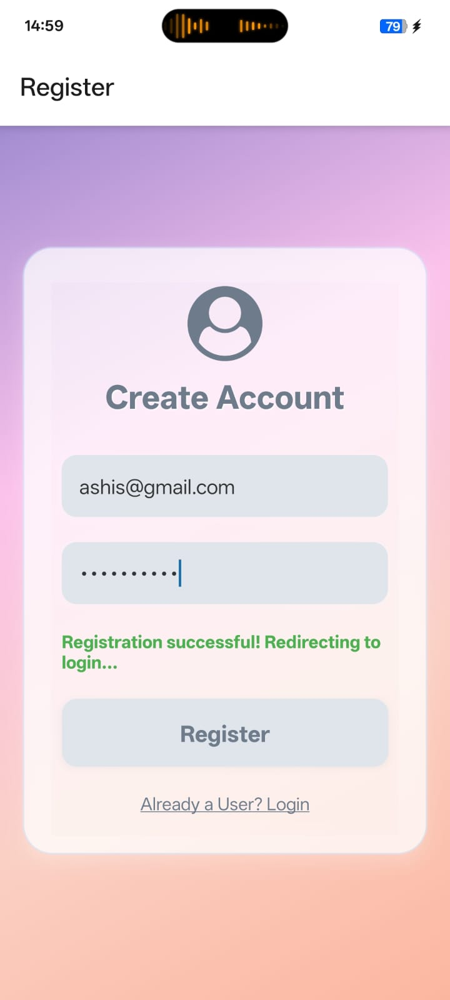
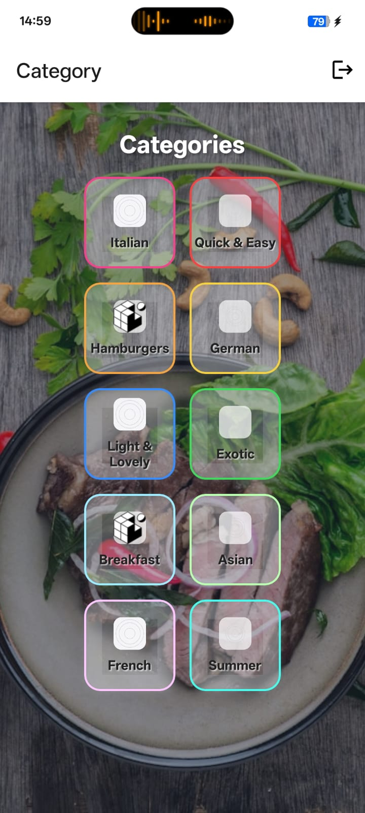
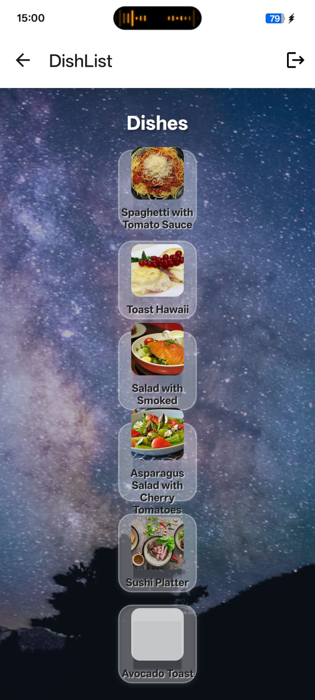
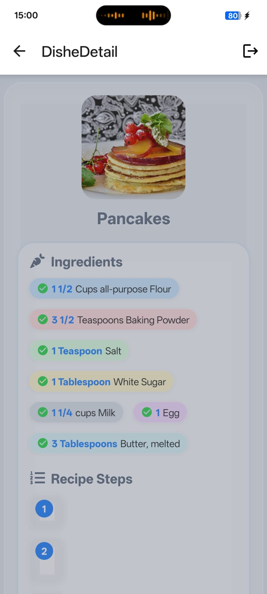
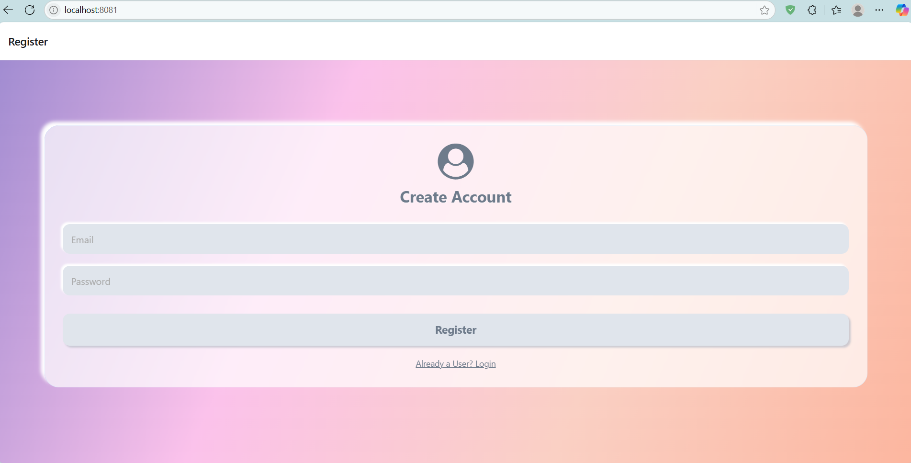

# 🚀 Recipe App


*A delightful, modern recipe sharing app with stunning UI and interactive food experiences!*

---

## 📸 Screenshots

| Home Page | Categories Page | Dishes Page | Recipe Detail | Mobile View |
|-----------|----------------|-------------|--------------|-------------|
|  |  |  |  | _mobile screenshot here!_ |

---

### Web Screenshots
- 
- 
- 
- 

### web Screenshot
- _web screenshot here!_

---

## ✨ Purpose of the App

> Recipe App is a visually stunning, interactive platform for browsing, sharing, and discovering delicious recipes. Designed for food lovers and home cooks, it features beautiful neumorphic and glassmorphic UI, animated interactions, and a seamless experience on both web and mobile. The app was inspired by the desire to make recipe discovery fun, modern, and accessible to everyone.

---

## 🛠 Tech Stack

- Frontend: React Native (Expo), Animated API, Neumorphism & Glassmorphism CSS/JS
- State Management: Redux Toolkit
- Image Sources: Unsplash/Pexels
- Platform: Web & Mobile (Expo Go)

---

## 🤝 Collaborators

| Name             | GitHub                                                                 | Email                        |
|------------------|------------------------------------------------------------------------|------------------------------|
| Ashis Kumar Dash | [@Ashis28](https://github.com/Ashis28/MealApp/tree/master)             | dashashiskumar38@gmail.com   |
| Justin Mathew    | N/A                                                                    | justinmathewfrancis@gmail.com|

---

## 📚 What We Learned

- How to break down complex problems into components.
- Working collaboratively using Git and GitHub.
- Integrating frontend with local data and animated UI.
- Handling form validations, UI feedback, and error handling.
- Responsive design for both web and mobile.

---

## 🚧 Installation & Running Locally

```bash
git clone https://github.com/Ashis28/MealApp.git
cd MealApp
npm install
npx expo start
```

- Scan the QR code with Expo Go (iOS/Android) or press `w` to open in your browser.

---

## 🖼️ Adding Screenshots
1. Take screenshots of your app (web or mobile).
2. Save them as `screenshot-categories.png`, `screenshot-dishes.png`, `screenshot-recipe.png`, and `screenshot-loginPaige.png` in the `assets/` folder.
3. For mobile, add your screenshot and update the table above!

---

## 💡 Specialities
- **Stunning UI/UX:** Modern, tactile, and interactive.
- **Fully Responsive:** Looks great on web and mobile.
- **Easy to Customize:** Swap out images, colors, or add your own recipes.
- **No backend needed:** All logic and data are local for instant demo.

---

> Made with ❤️ for beautiful food and beautiful code! 