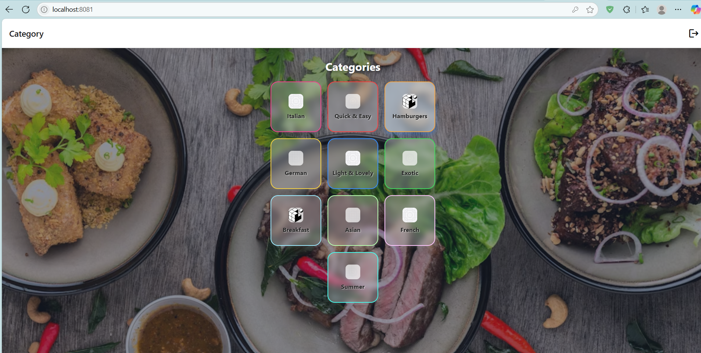
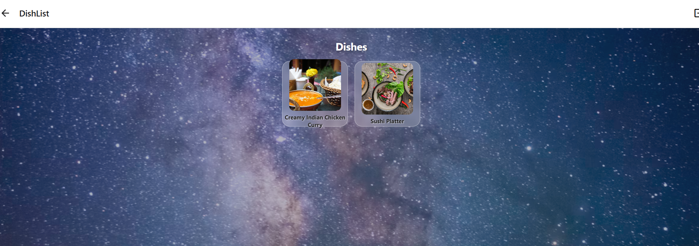
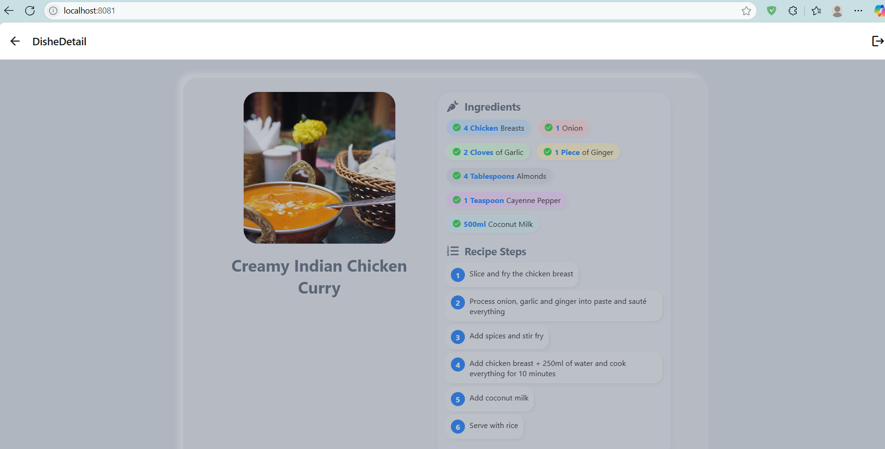

# Weather & Recipe App

A beautiful, modern React Native app featuring a Neumorphism and glassmorphism UI, animated interactions, and a delightful food/recipe experience. Built with Expo and Redux.

---

## 🌟 Overview
This app is a visually stunning demonstration of:
- Neumorphism and glassmorphism design
- Animated, interactive UI/UX
- Food/recipe browsing with real images
- Responsive layouts for web and mobile
- Modern authentication flow (dummy login)

---

## ✨ Features
- **Beautiful Category & Dish Browsing:**
  - Food categories and dishes with real images
  - Compact, responsive, and interactive grid layouts
- **Animated Recipe Details:**
  - Ingredients and steps with staggered animations
  - Mouse hover/press effects throughout the app
  - Glassmorphism and gradient backgrounds
- **Modern Auth Flow:**
  - Neumorphic login/register screens with validation and feedback
- **No Backend Required:**
  - All data is local, so you can demo instantly

---

## 📸 Screenshots

> **Tip:** Add your own screenshots to the `assets/` folder and update the image links below!

| Categories Screen | Dishes Screen | Recipe Detail |
|------------------|--------------|---------------|
|  |  |  |

---

## 🛠️ Technologies Used
- React Native (Expo)
- Redux Toolkit
- Animated API
- Neumorphism & Glassmorphism CSS/JS
- Unsplash/Pexels for food images

---

## 🚀 Getting Started

1. **Install dependencies:**
   ```sh
   npm install
   # or
   yarn
   ```
2. **Start the app:**
   ```sh
   npx expo start
   # or
   expo start
   ```
3. **Open on your device:**
   - Scan the QR code with Expo Go (iOS/Android)
   - Or press `w` to open in your browser

---

## 🖼️ Adding Screenshots
1. Take screenshots of your app (e.g., using Expo Go or your browser).
2. Save them as `screenshot-categories.png`, `screenshot-dishes.png`, and `screenshot-recipe.png` in the `assets/` folder.
3. The images will automatically appear in the table above!

---

## 💡 Specialities
- **Stunning UI/UX:** Modern, tactile, and interactive.
- **Fully Responsive:** Looks great on web and mobile.
- **Easy to Customize:** Swap out images, colors, or add your own recipes.
- **No backend needed:** All logic and data are local for instant demo.

---

> Made with ❤️ for beautiful food and beautiful code! 